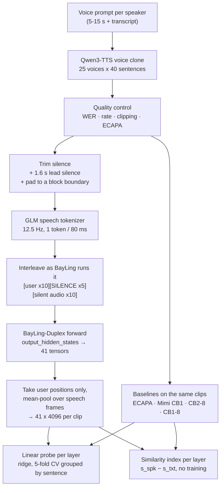
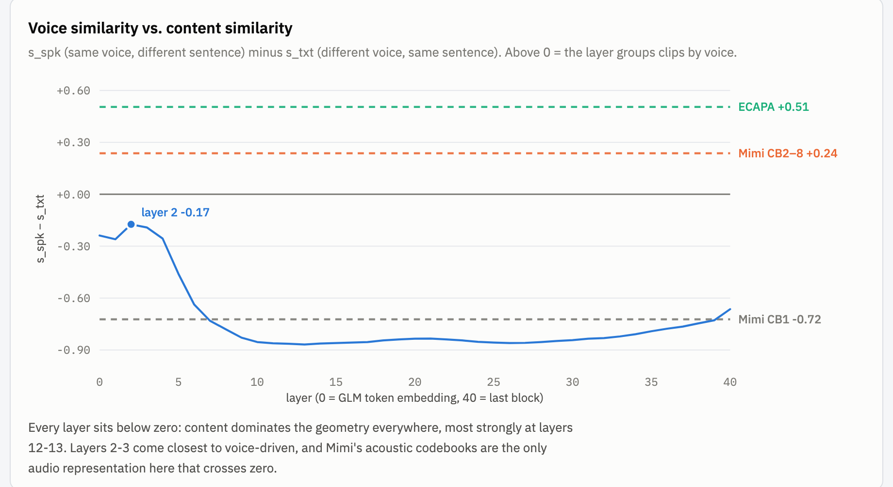
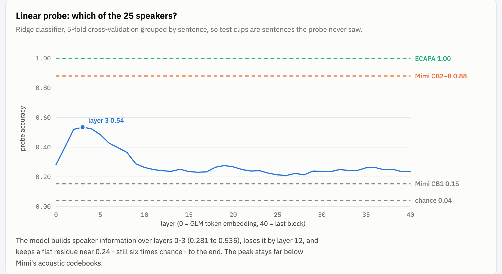

# Where does speaker identity live in BayLing-Duplex?

A layer-wise probe of the released BayLing-Duplex checkpoint, run to decide **which layer
BayLing-MP should inject Mimi features into** instead of adding them at the input embedding.

Run: 2026-09-18. Code: [`spkprobe/`](../spkprobe), results: `work/results/metrics.csv`.

---

## 1. Data

Content is held fixed and only the voice changes, so a probe cannot identify the speaker
from the words.

| | |
|---|---|
| Speakers | **25** cloned voices |
| Sentences | **40** Harvard sentences (IEEE 1969, lists 1-4), every voice reads every sentence |
| Clips synthesized | 1000 (25 x 40) |
| TTS | Qwen3-TTS-12Hz-1.7B-Base, in-context voice cloning from one 5-15 s prompt + its transcript per speaker |
| After quality control | **980** clips kept |
| Used by the analysis | **750** clips = 25 speakers x **30** sentences (only the complete grid) |

Quality control (`spkprobe/check_tts.py`) rejected a clip when Whisper-large-v3 WER > 0.2,
the speaking rate fell outside 1.2-5.0 words/s, the clip was clipped, or ECAPA similarity to
its own voice prompt was below 0.35. Rejections: rate 14, ref_sim 4, WER 2.

Two sanity checks on the synthesized set:

- **ECAPA similarity to the voice prompt**: mean 0.630, p10 0.525.
- **ECAPA can tell the 25 cloned voices apart**: nearest-centroid accuracy **0.994** (chance 0.040).
  Without this the probe would have nothing to find.

---

## 2. Pipeline

Layer indexing: **0 = the embedding output** (the GLM token itself, before any block),
*k* = the output of transformer block *k*, up to 40.

### The two metrics are different measurements

|  | Linear probe | Similarity index |
|---|---|---|
| Question | Can speaker identity be **read out** of this layer? | Does this layer **organize** clips by voice or by content? |
| Method | Train a ridge classifier on 24 sentences, test on 6 unseen ones, 5 folds | No training. Cosine between all pairs, `s_spk` (same voice, different sentence) minus `s_txt` (different voice, same sentence) |
| Scale | Accuracy over 25 classes, chance 0.040 | Difference of two mean cosines; 0 = neither dominates |
| Sees | One direction in the 4096-d space is enough - the rest may be noise | The whole space at once; a minority direction is outvoted |

They can disagree, and here they do: at layer 3 the probe reaches 0.535 while the index is
still −0.192. Speaker identity **is** linearly decodable there, but the geometry is still
dominated by content. Both numbers are needed: the probe says the information exists, the
index says how buried it is.

Settings: features z-scored per dimension (LLM hidden states are strongly anisotropic, so raw
cosines are all ~0.99); ridge strength chosen on a grouped inner split; folds grouped by
sentence so no test sentence is ever seen in training.

---

## 3. Results

Three phases across depth:

| Layers | probe accuracy | What happens |
|---|---|---|
| 0 → 3 | 0.281 → **0.535** | The model *builds* speaker information; layer 0 (the GLM token itself) already has 0.281, the first three blocks add the rest |
| 4 → 12 | 0.524 → 0.241 | It is washed out as the representation turns semantic |
| 13 → 40 | ~0.24, flat | A residue stays, six times chance, never returning to chance |

The similarity index is **negative at every layer**: content dominates the geometry
everywhere, least at layers 2-3 (−0.17) and most at layers 12-13 (−0.87).

The `greedy` context (the model decoding its own assistant channel) matches the `silence`
context within 0.011 at the peak, so what the assistant channel contains is not a confound.

---

## 4. Best layer vs. the baselines

Same clips, same probe, same folds.

| Representation | Dim | Speaker probe ↑ | Similarity index ↑ |
|---|---|---|---|
| **ECAPA-TDNN** (ceiling, built for speaker ID) | 192 | **0.997** | **+0.505** |
| **Mimi CB1-8** (what Moshi reads) | 512 | 0.897 | −0.036 |
| **Mimi CB2-8** (what BayLing-MP would inject) | 512 | **0.880** | **+0.237** |
| **BayLing layer 3** (best probe) | 4096 | **0.535** | −0.192 |
| BayLing layer 2 (best index) | 4096 | 0.520 | −0.174 |
| BayLing layer 0 (GLM token embedding) | 4096 | 0.281 | −0.238 |
| BayLing layer 40 (last block) | 4096 | 0.236 | −0.664 |
| **Mimi CB1** (semantic codebook) | 512 | 0.153 | −0.723 |
| Chance | - | 0.040 | - |

**What this decides:**

1. **Injection point: layers 2-4.** That is where speaker information is richest and most
   accessible. It is not the middle of the network, which is what the Lychee-FD gradient
   analysis had suggested.
2. **Injecting Mimi is justified.** Mimi's acoustic codebooks reach 0.880 where BayLing's best
   layer reaches 0.535, and they are the only audio representation here whose index is
   positive. Mimi's semantic codebook (0.153) is *worse* than BayLing, which confirms that
   the timbre lives in the acoustic codebooks, not the semantic one.
3. **A `<spk>` head alone will struggle.** Even the best layer is content-dominated
   (index −0.192), so a head reading hidden states has to fight the geometry.
4. **Later injection is not hopeless.** The curve plateaus at 0.24 rather than falling to
   chance, so layers around 10 remain a cheaper alternative worth one short trial.

---

## Limitations

- **A probe shows information is decodable, not that the model uses it.** Causality needs
  injection experiments: attach Mimi at a candidate layer, train briefly, and compare `<spk>`
  accuracy and the original turn-taking behaviour.
- **The content probe saturated.** Sentence identity is at 1.000 in every layer, so the
  intended contrast curve carries no information. 30 sentences are too easy for a linear
  classifier; a harder content task would be needed to make that comparison work.
- **Utterance-level pooling.** `<spk>` has to be predicted every 80 ms; these numbers are
  whole-clip averages. Re-run stage 3 with `--save-frames` for the frame-level view.
- **TTS voices, not real speakers.** Cloned voices may be cleaner and more separable than
  real recordings; confirm the conclusion on real speech (e.g. the VCTK paragraphs every
  speaker reads) before relying on it.
